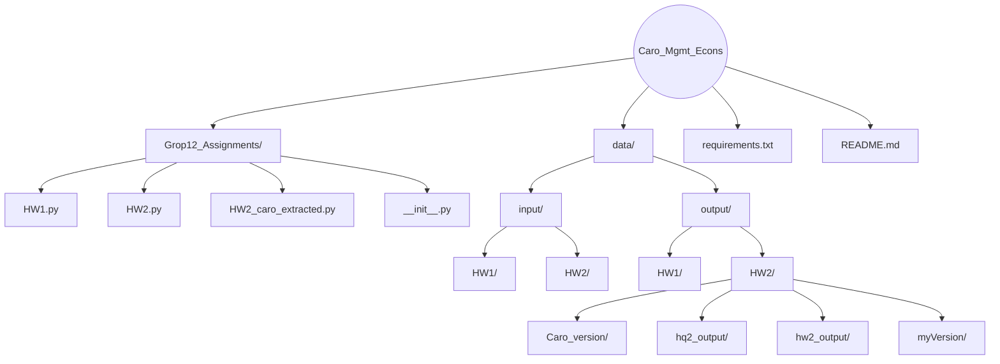

**Overview**
- Simple, reproducible plotting workflows for Managerial Economics assignments.
- Scripts generate figures programmatically and save them deterministically into the `data/output/...` tree.
- Math-sensitive plots (e.g., line intersections) are computed from equations, not hand‑placed.

**Structure**
- `Grop12_Assignments/HW1.py` — Three line/point plots; saves to `data/output/HW1`.
- `Grop12_Assignments/HW2.py` — Supply/Demand shift diagrams; saves to `data/output/HW2/hq2_output`.
- `Grop12_Assignments/HW2_caro_extracted.py` — Curated set of supply/demand diagrams; saves to `data/output/HW2/Caro_version` and creates a ZIP bundle.
- `requirements.txt` — Minimal runtime dependencies (NumPy, Matplotlib).

**Setup**
- Create/activate a virtual environment (optional but recommended).
- Install dependencies: `python -m pip install -r requirements.txt`.

**Usage**
- Generate HW1 figures:
  - `python Grop12_Assignments/HW1.py`
  - Outputs: `data/output/HW1/HW1_<index>_<slugified-title>.png`
- Generate HW2 figures (HQ2 set):
  - `python Grop12_Assignments/HW2.py`
  - Outputs: `data/output/HW2/hq2_output/HW2_<slugified-title>.png`
- Generate HW2 figures (Caro version):
  - `python Grop12_Assignments/HW2_caro_extracted.py`
  - Outputs: `data/output/HW2/Caro_version/*.png` and `clean_diagrams_bundle.zip`

**Implementation Notes**
- Filenames are derived from plot titles via a slugifier for consistent, safe paths.
- HW1 Graph 3 solves the system x + y = 35,000 and 300x + 250y = 9,750,000 using `numpy.linalg.solve` and annotates the exact intersection.
- All scripts avoid `plt.show()` to support headless execution; figures are closed after saving.

**Customization**
- Change output locations by editing the `output_dir` or save paths in each script.
- Adjust DPI and layout via `fig.savefig(..., dpi=300, bbox_inches='tight')`.

**Repo Structure (Mermaid)**

